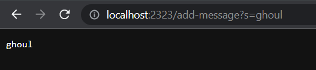
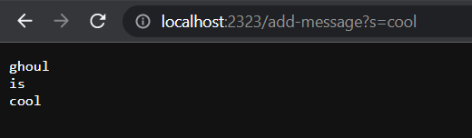
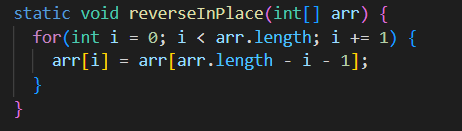

Lab Report 2!
===

---
Creating a String Server
---

I was tasked with creating a web server that "should keep track of a single string that gets added to by incoming requests"

This is how I did that:

```
import java.io.IOException;
import java.net.URI;


class Handler implements URLHandler {
    String s = "";
    public String handleRequest(URI url) {
        if (url.getPath().equals("/")) {
            return String.format(s);
        }
        else if (url.getPath().contains("/add-message")) {
            String[] message = url.getQuery().split("=");
            if(message[0].equals("s")){
                s += message[1] + "\n";
                return String.format(s);
            }  
        }
        return "404 Not Found!";
    }
}

class StringServer {
    public static void main(String[] args) throws IOException {
        if(args.length == 0){
            System.out.println("Missing port number, please try a different number!");
            return;
        }

        int port = Integer.parseInt(args[0]);

        Server.start(port, new Handler());
    }
}
```

This is my main StringServer.java file.

When ran it gives a link to a web server, and if you add `/add-message?s=<string>`(Where <string> is a message) to the end of the url 
the web page will update and display your message. 
	


The way this works is through the method handleRequest which analyzes the url and checks to see if certain things are in it.
	
In this case it checks to see if all parts of the add message request are there then saves the message to a string variable, and prints out that string.
	
As I've mentioned the string gets saved to a variable, because of this we can add on more messages and still see the previous messages that were added.
	

	
Here I've ran the url twice, once adding `/add-message?s=<is>` and the second time `/add-message?s=cool` 

Since the variable s exists outside of the method it retains the messages we have added to it allowing the web page to display all of them. 


Debugging
---

Let's take a look at some code that has a bug. 



This code is supposed to change the input array to be in reversed order.
At first glance the code may not look wrong, but lets write a test to see if it works the way that is intended. 
```
@Test 
public void testReverseInPlace() {
    int[] input1 = { 3 };
    ArrayExamples.reverseInPlace(input1);
    assertArrayEquals(new int[]{ 3 }, input1);
	}
 ```

When this code is run the result is as expected
> {3}
This is because this array contains only one element so the original order and reveresed order are the same.
Now for another test:
```
@Test
  public void testReversed2(){
    int[] input2 = {43, 91, 0};
    ArrayExamples.reversed(input2);
    assertArrayEquals(new int[]{0, 91, 43}, ArrayExamples.reversed(input2));
  }
```

**Uh Oh!** This test does not give us the expected output
>`Expected output:`
>	{0, 91, 43}

>`Actual output:`
>	{0, 0, 0}	

*Why did it do this?*

Well if we look back to the code we can analyze line by line...
```
 static void reverseInPlace(int[] arr) {
    for(int i = 0; i < arr.length; i += 1) {
      arr[i] = arr[arr.length - i - 1];
    }
  }
```
Hmmm... wait! I see multiple issues here; 
- Since the for loop runs through all the elements of the array after the halfway point the new array's values start to go back
- *So we need to fix the max value of i to half the length*
- BUT, if we change that then half of the array is untouched
- *To fix this we can create a new temp variable to hold the value that get changes, then have it moved*
This should look like:
```
static void reverseInPlace(int[] arr) {
    for(int i = 0; i < arr.length/2; i += 1) {
      int temp = arr[i];
      arr[i] = arr[arr.length - i - 1];
      arr[arr.length-i-1] = temp;
    }
  }
```
Now the code runs in a way that swaps the values with the one at the opposite end.

The first and last value get swapped, the second and second to last get swapped and so on till it reaches the middle, where all the values should have been moved.

What I've learned
===

---

Something that I learned in Lab 2 was how to upload changes that I made to a remote file. Throughout lab 2 and in lab 3 there were times where I would make changes to the code on my personal computer and those changes were able to be uploaded to the remote file online. This will allow me to make changes from multiple places and then access those changes anywhere else, which is very useful. 
